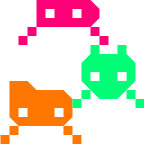
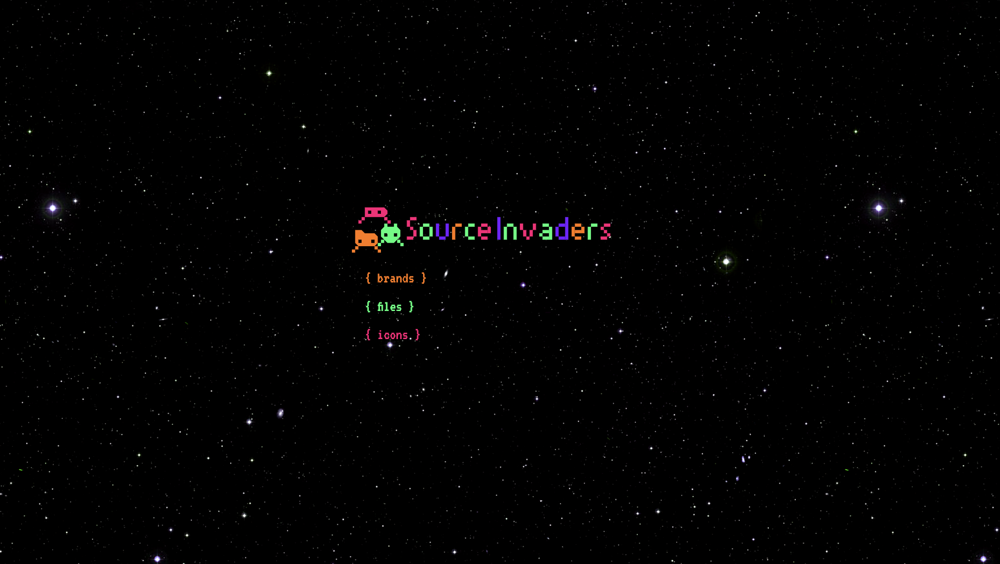
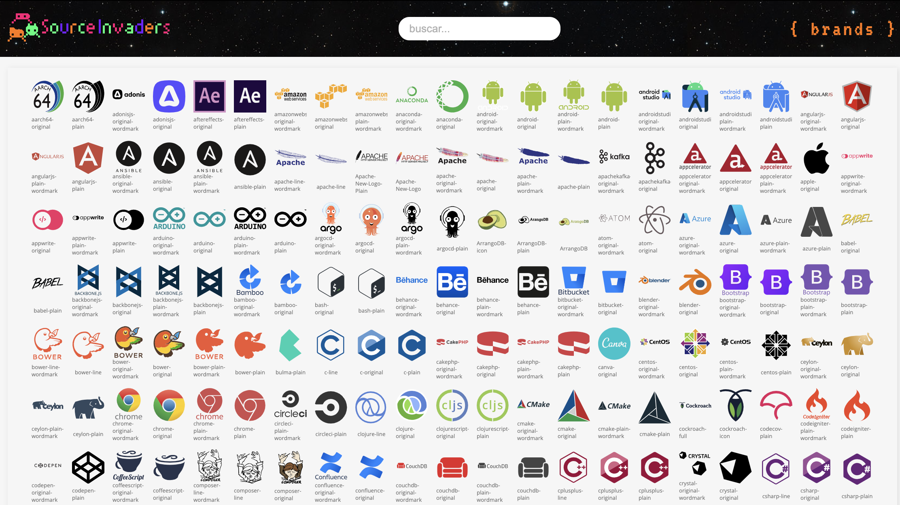
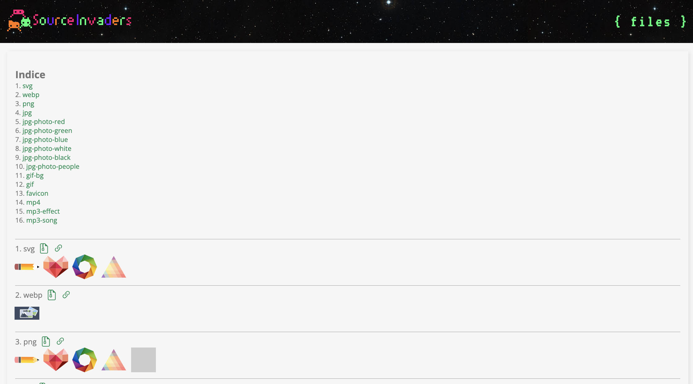
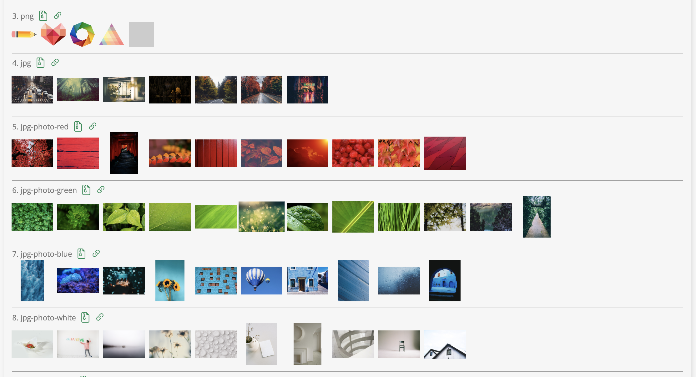

<div align="center">

<h3 align="center">Source Invaders</h3>
<p align="center">
A collection of logos, images, video, sounds to your project
<br><br>
<a href="https://patricio-dsgn.github.io/source-invaders/">View Demo</a> <br>
<a href="https://github.com/patricio-dsgn/source-invaders/issues">Report Bug</a> <br>
<a href="https://github.com/patricio-dsgn/source-invaders/issues">Request Feature</a> <br>
</p>
</div>

## About The Project





Welcome to the GitHub README Template! This repository is designed to simplify and enhance the creation of READMEs for your GitHub projects. We believe that clear and effective documentation is essential for making your project understandable and accessible to other developers and users.

Why This Template?
While there are indeed many README templates available on GitHub, we've created this one with a specific goal in mind:

* Streamline Creation: We want to make it as straightforward as possible to create an informative and visually appealing README. With this template, you can focus on what truly matters: your project.

* Promote Best Practices: We've incorporated best practices for project documentation on GitHub. This includes key sections and tips for effectively explaining your project.

* Flexibility: We understand that every project is unique. Therefore, this template is entirely customizable. You can add or remove sections to suit your specific needs.

**How to Use This Template**:
Getting started is easy. Simply clone this repository or download the BLANK_README.md file and customize it to fit your project's requirements. Be sure to review the instructions and tips included in each section for the best results.

**Contribute and Share**:
We believe in collaboration and the spirit of open source. If you have ideas for improving this template or wish to contribute, you're more than welcome! You can do so through pull requests or by reporting issues. Together, we can make this template even better.

**Get Started Now**:
Don't waste time creating a README from scratch. Use this template as a starting point and showcase what makes your project unique. Let us help you create high-quality documentation and make your project shine on GitHub.

Let's get started!

**Built With**:
In the following sections, we'll list the technologies used to construct this project.

*  php
*  laravel

<br>

*  bash

<br>

*  html5

<br>

*  css3
*  tailwindcss
*  bootstrap
*  bulma
*  picocss
*  materializecss

<br>

*  javascript
*  node.js
*  react
*  vue.js
*  angular.js
*  svelte
*  typescript

<br>

*  npm
*  yarn

<br>

*  mongodb
*  redis
*  mysql
*  postgresql

<br>

*  python
*  django


## Getting Started

This is an example of how you may give instructions on setting up your project locally.
To get a local copy up and running follow these simple example steps.

**Prerequisites**:

This is an example of how to list things you need to use the software and how to install them.

- npm
  ```sh
  npm install npm@latest -g
  ```

**Installation**:

1. Clone the repo
   ```sh
   git clone https://github.com/your_username_/Project-Name.git
   ```

## Usage

Use this space to show useful examples of how a project can be used. Additional screenshots, code examples and demos work well in this space. You may also link to more resources.

_For more examples, please refer to the [Documentation](https://example.com)_


## Roadmap

- [x] Add Changelog
- [ ] add language (Spanish)

See the [open issues](https://github.com/patricio-dsgn/source-invaders/issues) for a full list of proposed features (and known issues).

## Contributing

Contributions are what make the open source community such an amazing place to learn, inspire, and create. Any contributions you make are **greatly appreciated**.

If you have a suggestion that would make this better, please fork the repo and create a pull request. You can also simply open an issue with the tag "enhancement".
Don't forget to give the project a star! Thanks again!

1. Fork the Project
2. Create your Feature Branch (`git checkout -b feature/AmazingFeature`)
3. Commit your Changes (`git commit -m 'Add some AmazingFeature'`)
4. Push to the Branch (`git push origin feature/AmazingFeature`)
5. Open a Pull Request

## License

Distributed under the MIT License. See <a href="LICENSE.txt">LICENSE.txt</a> for more information.

## Contact

* Author: <a href="https://github.com/patricio-dsgn/">https://github.com/patricio-dsgn/</a>
* Project Link: <a href="https://github.com/patricio-dsgn/source-invaders/">https://github.com/patricio-dsgn/</a>

## Acknowledgments

I'd like to express my gratitude to the following resources that have been instrumental in this project's development. They've been immensely helpful, and I highly recommend checking them out:

- [Choose an Open Source License](https://choosealicense.com/): A valuable resource for selecting an open-source license for your projects.
- [GitHub Emoji Cheat Sheet](https://www.webpagefx.com/tools/emoji-cheat-sheet): A fun and handy guide to using emojis in your GitHub projects.
- [Malven's Flexbox Cheatsheet](https://malven.co/): An excellent reference for mastering CSS Flexbox.
- [Malven's Grid Cheatsheet](https://malven.co/): A comprehensive guide to CSS Grid Layout.
- [Img Shields](https://shields.io/): Generate custom badges for your project's readme with ease.
- [GitHub Pages](https://pages.github.com/): A great way to host your project's website directly from your GitHub repository.
- [Font Awesome](https://fontawesome.com/): A fantastic collection of free icons and tools for web projects.
- [React Icons](https://react-icons.github.io/react-icons/): A library of popular icons for use in React applications.

These resources have played a significant role in making this project possible. Thank you for providing such valuable tools and references!